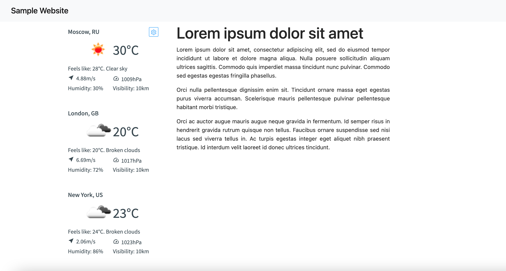
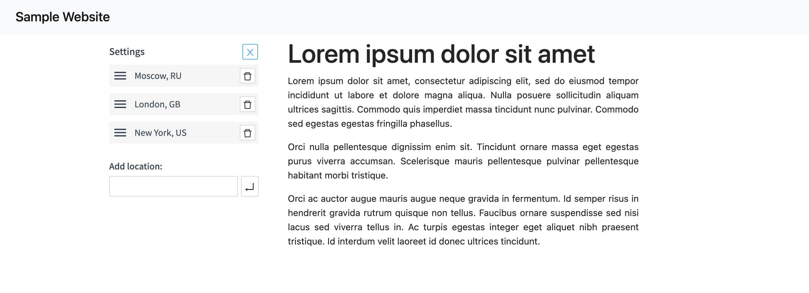

# Weather Widget

===
Technologies: React, Typescript/ES7 and Babel, SCSS, Webpack

- Users able to add this widget to their websites as simple as inserting the snippet into an HTML-page.
- Users able to add cities and remove, reorder by dragging and dropping.
- Configuration saved in local storage and restored on future visits.
- The application is made with possibility of development and scaling. Used technologies as Husky, Prettier.
  Models of Typescript, Api, Components are taken out separately.





Install dependencies:

```
npm install
```

Run for development:

```
npm run start
```

Production build:

```
npm run build
```
